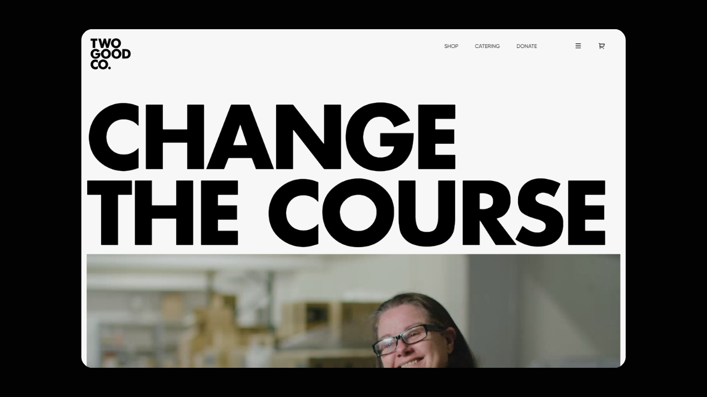

# Create a Responsive Ecommerce Website for Two Good Co Using GSAP and Locomotive Scroll
## Two Good Co – Responsive Minimal Brand Website

 <!-- Replace with your actual image path or GitHub raw URL -->

A fully responsive, smooth-scrolling website inspired by Two Good Co. Built with modern animations using **GSAP ScrollTrigger** and **Locomotive Scroll**, this project showcases a clean, user-centric design ideal for brands, product showcases, or portfolios.

## 🌐 Live Demo

[View Website](https://codinggujarat.github.io/Create-A-Responsive-Ecommerce-Website-for-Two-Good-Co-Using-GSAP-and-Locomotive-Scroll/) <!-- Replace with your deployed URL -->

---

## 📸 Preview

 <!-- Replace with correct image file -->

---

## ✨ Features

- Smooth scrolling experience with Locomotive Scroll
- Scroll-triggered animations using GSAP ScrollTrigger
- Responsive design for desktop, tablet, and mobile
- Minimal and elegant UI inspired by modern product brands
- Easy-to-customize layout and styles

---

## 🛠️ Tech Stack

- HTML5, CSS3, JavaScript
- GSAP (GreenSock Animation Platform)
- ScrollTrigger Plugin
- Locomotive Scroll
- Google Fonts

---

## 🚀 Getting Started

1. Clone the repo:

```bash
git clone https://github.com/codinggujarat/Create-A-Responsive-Ecommerce-Website-for-Two-Good-Co-Using-GSAP-and-Locomotive-Scroll.git
